<b>🇧🇷 Português</b> · <a href="README.en.md">🇺🇸 English</a>

  

  
  
  
  
  

## 👨‍💻 Sobre mim

- 🎓 Ciência da Computação no **IFPR**, em Curitiba
- 💼 Estagiário de desenvolvimento na **Celepar** (desde ago/2026) — antes, estagiário de TI na **Lottopar** (abr/2025 – abr/2026)
- 🛠️ Gosto de construir ferramentas para problemas que eu mesmo tenho: o bot que caça vagas pra mim, o app de metas que uso todo dia
- 🐧 Ubuntu no dia a dia, tudo rodando em Docker

## 🧰 Stack

  

## 🚀 Projetos em destaque

  
  

  
  

  
  

## 📊 No GitHub

  
  

## 🐍 Contribuições

<picture>
  <source media="(prefers-color-scheme: dark)" srcset="https://raw.githubusercontent.com/MvitorLS/MvitorLS/output/github-contribution-grid-snake-dark.svg">
  <source media="(prefers-color-scheme: light)" srcset="https://raw.githubusercontent.com/MvitorLS/MvitorLS/output/github-contribution-grid-snake.svg">
  
</picture>
